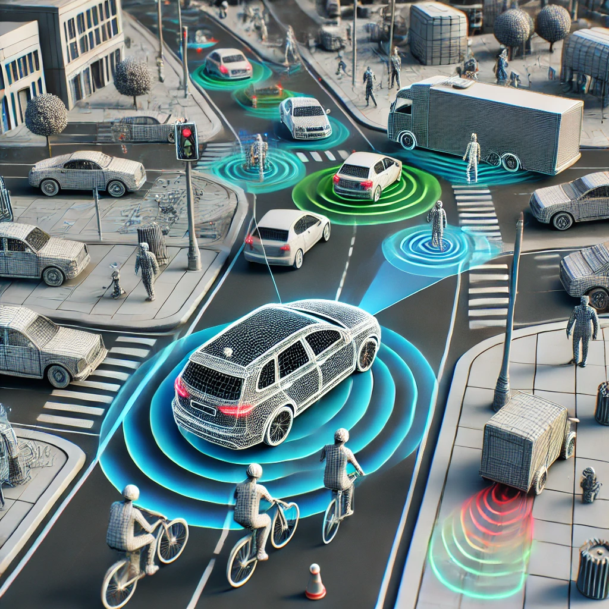

# Autonomous-Driving-Perception
A Comprehensive Review of 3D Object Detection in Autonomous Driving: Technological Advances and Future Directions

    

    <a href="https://scholar.google.com/citations?user=作者1的Google Scholar链接"><strong>作者1名字</strong></a>
    .
    <a href="https://scholar.google.com/citations?user=作者2的Google Scholar链接"><strong>作者2名字</strong></a>
    .
    <strong>作者3名字</strong>
    .
    <a href="https://scholar.google.com/citations?user=作者4的Google Scholar链接"><strong>作者4名字</strong></a>
    .
    <a href="https://scholar.google.com/citations?user=作者5的Google Scholar链接"><strong>作者5名字</strong></a>

    

# 3D Occupancy Perception in Autonomous Driving

This repository is associated with the review paper titled "**3D Occupancy Perception for Autonomous Driving**," which provides a comprehensive overview of recent advancements in 3D dense perception. The review covers various methodologies, including **LiDAR-Centric Occupancy Perception**, **Vision-Centric Occupancy Perception**, and **Multi-Modal Occupancy Perception**.

We discuss the state-of-the-art information fusion techniques and provide insights into the future directions of 3D perception in autonomous driving. This repository will be actively maintained with updates and additional resources. We believe this will be the most comprehensive survey to date on 3D Occupancy Perception.

## Overview

- **Paper Title**: 3D Occupancy Perception for Autonomous Driving
- **Authors**: [作者1名字](https://scholar.google.com/citations?user=作者1的Google Scholar链接), [作者2名字](https://scholar.google.com/citations?user=作者2的Google Scholar链接), [作者3名字](#), [作者4名字](https://scholar.google.com/citations?user=作者4的Google Scholar链接), [作者5名字](https://scholar.google.com/citations?user=作者5的Google Scholar链接)
- **Link to Paper**: [arXiv](https://arxiv.org/abs/你的论文链接)

## Abstract

*The abstract of your paper can be briefly summarized here or directly quoted.*

## Key Contributions

- A detailed review of current 3D occupancy perception methods in autonomous driving.
- Comparison of LiDAR-Centric, Vision-Centric, and Multi-Modal approaches.
- Insights into the future research directions in the field.
- Discussion of the challenges and opportunities in 3D occupancy perception.

## Related Work

- [Paper 1 Title](https://link-to-paper1)
- [Paper 2 Title](https://link-to-paper2)
- [Paper 3 Title](https://link-to-paper3)

## Citation

If you find this review useful in your research, please consider citing:
