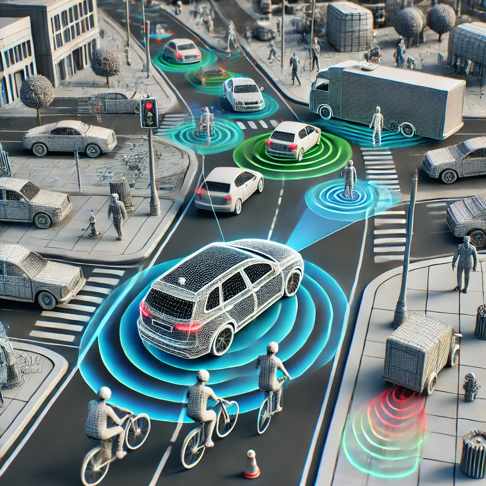

<div align="center">

[](https://arxiv.org/abs/2408.16530)

# A Comprehensive Review of 3D Object Detection in Autonomous Driving: Technological Advances and Future Directions

[Yu Wang](https://scholar.google.com/citations?user=EsZuitIAAAAJ&hl=zh-TW) · Shaohua Wang · Yicheng Li · Mingchun Liu

[](https://arxiv.org/abs/2408.16530)
[](https://github.com/Fishsoup0/Autonomous-Driving-Perception)
[](CONTRIBUTING.md)
[](LICENSE)
[](https://github.com/Fishsoup0/Autonomous-Driving-Perception/stargazers)
[](https://github.com/Fishsoup0/Autonomous-Driving-Perception/commits/main)

*A curated and actively maintained collection of papers, datasets, and toolboxes on 3D perception for autonomous driving — tracking the latest from **CVPR 2026, ICCV 2025, NeurIPS 2025, ICLR 2025** and more, across 3D detection, occupancy prediction, end-to-end driving, world models, VLA models, and V2X cooperative perception.*

**⭐ If you find this repository helpful, please consider giving it a star and [citing our survey](#citation)!**

</div>

---

## 🔥 News

- **[2026-07]** 🚀 Major refresh: added the latest works from **CVPR 2026, ICCV 2025, NeurIPS 2025, ICLR 2025, AAAI 2025** and recent arXiv preprints; new sections on **World Models**, **VLA / VLM for Driving**, and **Robustness & Test-Time Adaptation**.
- **[2026-07]** Added a [2025–2026 Highlights](#-20252026-highlights) section for a quick view of frontier trends.
- **[2024-08]** 📄 Our survey is released on [arXiv](https://arxiv.org/abs/2408.16530).

---

## 📖 Table of Contents

- [2025–2026 Highlights](#-20252026-highlights)
- [About the Survey](#about-the-survey)
- [Datasets](#datasets)
- [Simulators & Toolboxes](#simulators--toolboxes)
- [Papers](#papers)
  - [Camera-Based 3D Object Detection](#camera-based-3d-object-detection)
  - [LiDAR-Based 3D Object Detection](#lidar-based-3d-object-detection)
  - [Fusion-Based 3D Object Detection](#fusion-based-3d-object-detection)
  - [3D Occupancy Prediction](#3d-occupancy-prediction)
  - [End-to-End Autonomous Driving](#end-to-end-autonomous-driving)
  - [World Models for Autonomous Driving](#world-models-for-autonomous-driving)
  - [VLA / VLM for Autonomous Driving](#vla--vlm-for-autonomous-driving)
  - [V2X Cooperative Perception](#v2x-cooperative-perception)
  - [Robustness, Domain Adaptation & Test-Time Adaptation](#robustness-domain-adaptation--test-time-adaptation)
- [Related Surveys](#related-surveys)
- [Contributing](#contributing)
- [Citation](#citation)
- [License](#license)

---

## 🔥 2025–2026 Highlights

A quick snapshot of where the field is heading, based on the newest publications:

| Trend | Representative Works |
|---|---|
| **Gaussian-centric scene representation** | GaussianFormer (ECCV 2024), GaussianWorld (CVPR 2025), GaussianAD, S2GO |
| **Diffusion & generative policies for planning** | DiffusionDrive (CVPR 2025), RecogDrive, UniUGP |
| **World models as pre-training / simulators** | PreWorld (ICLR 2025), ResWorld (2026), DriveMamba (2026), Infra-centric world models (2026) |
| **VLA: from perception to language-action** | OpenDriveVLA, OccVLA, OccLLaMA |
| **Cooperative perception goes end-to-end & heterogeneous** | UniV2X (AAAI 2025), STAMP (ICLR 2025), CoopTrack (ICCV 2025), SparseAlign (CVPR 2025) |
| **Fully sparse architectures everywhere** | SparseDrive (ICRA 2025), SparseAlign, S2GO, SAFDNet |

---

## About the Survey

This repository accompanies the review paper **"A Comprehensive Review of 3D Object Detection in Autonomous Driving: Technological Advances and Future Directions"**, which provides an extensive overview of 3D object perception for autonomous driving, covering camera-based, LiDAR-based, and fusion detection techniques, and discussing future directions such as temporal perception, occupancy grids, end-to-end learning frameworks, and cooperative perception.

<details>
<summary><b>Abstract (click to expand)</b></summary>

In recent years, 3D object perception has become a crucial component in the development of autonomous driving systems, providing essential environmental awareness. However, as perception tasks in autonomous driving evolve, their variants have increased, leading to diverse insights from industry and academia. Currently, there is a lack of comprehensive surveys that collect and summarize these perception tasks and their developments from a broader perspective. This review extensively summarizes traditional 3D object detection methods, focusing on camera-based, LiDAR-based, and fusion detection techniques. We provide a comprehensive analysis of the strengths and limitations of each approach, highlighting advancements in accuracy and robustness. Furthermore, we discuss future directions, including methods to improve accuracy such as temporal perception, occupancy grids, and end-to-end learning frameworks. We also explore cooperative perception methods that extend the perception range through collaborative communication. By providing a holistic view of the current state and future developments in 3D object perception, we aim to offer a more comprehensive understanding of perception tasks for autonomous driving.

</details>

---

## Datasets

### General Autonomous Driving Perception

| Dataset | Type | Sensors | Highlights | Link |
|---|---|---|---|---|
| **KITTI** | Real | LiDAR + Camera | Classic benchmark for 2D/3D detection, stereo, depth | [Website](http://www.cvlibs.net/datasets/kitti/) |
| **nuScenes** | Real | LiDAR + Camera + Radar | 360° perception, tracking, sensor fusion | [Website](https://www.nuscenes.org/) |
| **Waymo Open Dataset** | Real | LiDAR + Camera | Large-scale 3D detection, tracking, segmentation | [Website](https://waymo.com/open/) |
| **Argoverse 2** | Real | LiDAR + Camera | Long-range detection, HD maps, forecasting | [Website](https://www.argoverse.org/av2.html) |
| **KITTI-360** | Real | LiDAR + Camera | 360° scene reconstruction, mapping, localization | [Website](http://www.cvlibs.net/datasets/kitti-360/) |

### 3D Occupancy & Scene Understanding

| Dataset | Type | Highlights | Link |
|---|---|---|---|
| **Occ3D** (nuScenes / Waymo) | Real | Standard benchmark for 3D occupancy prediction | [GitHub](https://github.com/Tsinghua-MARS-Lab/Occ3D) |
| **SemanticKITTI** | Real | Semantic segmentation, scene completion | [Website](http://www.semantic-kitti.org/) |
| **OpenScene** | Real | Large-scale occupancy benchmark built on nuPlan | [GitHub](https://github.com/OpenDriveLab/OpenScene) |

### V2X / Cooperative Perception

| Dataset | Type | Highlights | Link |
|---|---|---|---|
| **OPV2V** | Sim | First large-scale V2V benchmark (CARLA) | [Website](https://mobility-lab.seas.ucla.edu/opv2v/) |
| **V2XSet** | Sim | V2X with realistic noise simulation | [GitHub](https://github.com/DerrickXuNu/v2x-vit) |
| **V2X-Sim** | Sim | Multi-agent collaborative perception | [Website](https://ai4ce.github.io/V2X-Sim/) |
| **DAIR-V2X** | Real | First real-world vehicle-infrastructure dataset | [GitHub](https://github.com/AIR-THU/DAIR-V2X) |
| **V2V4Real** | Real | Real-world V2V cooperative perception (CVPR 2023) | [GitHub](https://github.com/ucla-mobility/V2V4Real) |
| **TUMTraf V2X** | Real | V2I cooperative perception (CVPR 2024) | [Website](https://tum-traffic-dataset.github.io/tumtraf-v2x/) |
| 🔥 **Multi-V2X** | Sim | Multi-penetration-rate cooperative dataset (2024) | [Paper](https://arxiv.org/abs/2409.04980) |
| 🔥 **AirV2X** | Sim | Unified air-ground (UAV + vehicle + RSU) V2X collaboration (2025) | [Paper](https://arxiv.org/abs/2506.19283) |

---

## Simulators & Toolboxes

| Name | Description | Link |
|---|---|---|
| **CARLA** | The de-facto standard open-source simulator for closed-loop AD research | [Website](https://carla.org/) |
| **OpenPCDet** | Widely-used toolbox for LiDAR-based 3D detection | [GitHub](https://github.com/open-mmlab/OpenPCDet) |
| **MMDetection3D** | OpenMMLab's general 3D detection platform | [GitHub](https://github.com/open-mmlab/mmdetection3d) |
| **OpenCOOD** | Standard framework for V2X cooperative detection | [GitHub](https://github.com/DerrickXuNu/OpenCOOD) |

---

## Papers

> Format: **Method** — Venue Year | [Paper] | [Code]. Newest first within each section. 🔥 marks 2025–2026 works.

### Camera-Based 3D Object Detection

- 🔥 **Weak-to-Strong Eliciting** — arXiv 2024 | [Paper](https://arxiv.org/abs/2404.06700) — scaling multi-camera 3D detection
- **Far3D** — AAAI 2024 | [Paper](https://arxiv.org/abs/2308.09616) | [Code](https://github.com/megvii-research/Far3D) — long-range surround-view detection
- **SparseBEV** — ICCV 2023 | [Paper](https://arxiv.org/abs/2308.09244) | [Code](https://github.com/MCG-NJU/SparseBEV) — fully sparse high-performance detector
- **StreamPETR** — ICCV 2023 | [Paper](https://arxiv.org/abs/2303.11926) | [Code](https://github.com/exiawsh/StreamPETR) — object-centric temporal modeling
- **BEVDepth** — AAAI 2023 | [Paper](https://arxiv.org/abs/2206.10092) | [Code](https://github.com/Megvii-BaseDetection/BEVDepth) — reliable depth for BEV detection
- **BEVFormer** — ECCV 2022 | [Paper](https://arxiv.org/abs/2203.17270) | [Code](https://github.com/fundamentalvision/BEVFormer) — spatiotemporal BEV transformer
- **PETR** — ECCV 2022 | [Paper](https://arxiv.org/abs/2203.05625) | [Code](https://github.com/megvii-research/PETR) — 3D position embedding
- **DETR3D** — CoRL 2021 | [Paper](https://arxiv.org/abs/2110.06922) | [Code](https://github.com/WangYueFt/detr3d) — sparse 3D queries from multi-view images
- **BEVDet** — arXiv 2021 | [Paper](https://arxiv.org/abs/2112.11790) | [Code](https://github.com/HuangJunJie2017/BEVDet) — LSS-based BEV framework
- **FCOS3D** — ICCVW 2021 | [Paper](https://arxiv.org/abs/2104.10956) | [Code](https://github.com/open-mmlab/mmdetection3d) — one-stage monocular detection

### LiDAR-Based 3D Object Detection

- 🔥 **UniLION** — arXiv 2025 | [Paper](https://arxiv.org/abs/2511.01768) — unified AD model (detection / tracking / occupancy / planning) with linear group RNNs
- 🔥 **LION** — NeurIPS 2024 | [Paper](https://arxiv.org/abs/2407.18232) — linear group RNN backbone for 3D detection
- 🔥 **Voxel Mamba** — NeurIPS 2024 | [Paper](https://arxiv.org/abs/2406.10700) — group-free state space models for point clouds
- **SAFDNet** — CVPR 2024 | [Paper](https://arxiv.org/abs/2403.05817) | [Code](https://github.com/zhanggang001/HEDNet) — simple and effective fully sparse detector
- **DSVT** — CVPR 2023 | [Paper](https://arxiv.org/abs/2301.06051) | [Code](https://github.com/Haiyang-W/DSVT) — dynamic sparse voxel transformer
- **VoxelNeXt** — CVPR 2023 | [Paper](https://arxiv.org/abs/2303.11301) | [Code](https://github.com/dvlab-research/VoxelNeXt) — fully sparse voxel detection
- **CenterPoint** — CVPR 2021 | [Paper](https://arxiv.org/abs/2006.11275) | [Code](https://github.com/tianweiy/CenterPoint) — center-based detection and tracking
- **PV-RCNN** — CVPR 2020 | [Paper](https://arxiv.org/abs/1912.13192) | [Code](https://github.com/open-mmlab/OpenPCDet) — point-voxel feature aggregation
- **PointPillars** — CVPR 2019 | [Paper](https://arxiv.org/abs/1812.05784) — fast pillar encoding, industry workhorse
- **SECOND** — Sensors 2018 | [Paper](https://www.mdpi.com/1424-8220/18/10/3337) | [Code](https://github.com/traveller59/second.pytorch) — sparse 3D convolution

### Fusion-Based 3D Object Detection

- 🔥 **GaussianPretrain** — arXiv 2024 | [Paper](https://arxiv.org/abs/2411.12452) — unified 3D Gaussian representation for visual pre-training
- **IS-Fusion** — CVPR 2024 | [Paper](https://arxiv.org/abs/2403.15241) | [Code](https://github.com/yinjunbo/IS-Fusion) — instance-scene collaborative fusion
- **RCBEVDet** — CVPR 2024 | [Paper](https://arxiv.org/abs/2403.16440) | [Code](https://github.com/VDIGPKU/RCBEVDet) — radar-camera BEV fusion
- **CMT** — ICCV 2023 | [Paper](https://arxiv.org/abs/2301.01283) | [Code](https://github.com/junjie18/CMT) — cross-modal transformer, robust to sensor failure
- **UniTR** — ICCV 2023 | [Paper](https://arxiv.org/abs/2308.07732) | [Code](https://github.com/Haiyang-W/UniTR) — unified modality-agnostic backbone
- **BEVFusion** — ICRA 2023 | [Paper](https://arxiv.org/abs/2205.13542) | [Code](https://github.com/mit-han-lab/bevfusion) — multi-task multi-sensor BEV fusion
- **TransFusion** — CVPR 2022 | [Paper](https://arxiv.org/abs/2203.11496) | [Code](https://github.com/XuyangBai/TransFusion) — transformer-based robust LiDAR-camera fusion

### 3D Occupancy Prediction

- 🔥 **Dr.Occ** — CVPR 2026 | [Paper](https://openaccess.thecvf.com/CVPR2026?day=all) — depth- and region-guided occupancy from surround-view cameras
- 🔥 **GS-Occ3D** — arXiv 2025 | [Paper](https://arxiv.org/abs/2507.19451) — scaling vision-only occupancy reconstruction with Gaussian splatting
- 🔥 **S2GO** — arXiv 2025 | [Paper](https://arxiv.org/abs/2506.05473) — streaming sparse Gaussian occupancy prediction
- 🔥 **GaussianWorld** — CVPR 2025 | [Paper](https://arxiv.org/abs/2412.10373) — Gaussian world model for streaming occupancy
- 🔥 **PreWorld** — ICLR 2025 | [Paper](https://arxiv.org/abs/2502.07309) — semi-supervised vision-centric 3D occupancy world model
- **GaussianFormer** — ECCV 2024 | [Paper](https://arxiv.org/abs/2405.17429) | [Code](https://github.com/huang-yh/GaussianFormer) — 3D Gaussians as scene representation
- **SparseOcc** — ECCV 2024 | [Paper](https://arxiv.org/abs/2312.17118) | [Code](https://github.com/MCG-NJU/SparseOcc) — fully sparse occupancy prediction
- **SelfOcc** — CVPR 2024 | [Paper](https://arxiv.org/abs/2311.12754) | [Code](https://github.com/huang-yh/SelfOcc) — self-supervised vision-based occupancy
- **Cam4DOcc** — CVPR 2024 | [Paper](https://arxiv.org/abs/2311.17663) | [Code](https://github.com/haomo-ai/Cam4DOcc) — camera-only 4D occupancy forecasting benchmark
- **FlashOcc** — arXiv 2023 | [Paper](https://arxiv.org/abs/2311.12058) | [Code](https://github.com/Yzichen/FlashOCC) — fast channel-to-height occupancy
- **Occ3D** — NeurIPS 2023 | [Paper](https://arxiv.org/abs/2304.14365) | [Code](https://github.com/Tsinghua-MARS-Lab/Occ3D) — large-scale occupancy benchmark
- **FB-OCC** — CVPRW 2023 | [Paper](https://arxiv.org/abs/2307.01492) | [Code](https://github.com/NVlabs/FB-BEV) — forward-backward view transformation, challenge winner
- **SurroundOcc** — ICCV 2023 | [Paper](https://arxiv.org/abs/2303.09551) | [Code](https://github.com/weiyithu/SurroundOcc) — multi-camera dense occupancy
- **TPVFormer** — CVPR 2023 | [Paper](https://arxiv.org/abs/2302.07817) | [Code](https://github.com/wzzheng/TPVFormer) — tri-perspective view representation

### End-to-End Autonomous Driving

- 🔥 **DriveMamba** — arXiv 2026 | [Paper](https://arxiv.org/abs/2602.13301) — task-centric scalable state space model for E2E driving
- 🔥 **Risk-Prioritized Game Planning** — arXiv 2026 | [Paper](https://arxiv.org/abs/2604.05449) — from global attention dilution to risk-prioritized planning
- 🔥 **UniUGP** — arXiv 2025 | [Paper](https://arxiv.org/abs/2512.09864) — unifying understanding, generation, and planning
- 🔥 **RecogDrive** — arXiv 2025 | [Paper](https://arxiv.org/abs/2506.08052) — reinforced cognitive framework for E2E driving
- 🔥 **DiffusionDrive** — CVPR 2025 | [Paper](https://arxiv.org/abs/2411.15139) | [Code](https://github.com/hustvl/DiffusionDrive) — truncated diffusion policy for planning
- 🔥 **SparseDrive** — ICRA 2025 | [Paper](https://arxiv.org/abs/2405.19620) | [Code](https://github.com/swc-17/SparseDrive) — sparse scene representation E2E driving
- **BEV-Planner** — CVPR 2024 | [Paper](https://arxiv.org/abs/2312.03031) | [Code](https://github.com/NVlabs/BEV-Planner) — is ego status all you need?
- **VAD** — ICCV 2023 | [Paper](https://arxiv.org/abs/2303.12077) | [Code](https://github.com/hustvl/VAD) — vectorized scene representation for planning
- **UniAD** — CVPR 2023 (Best Paper) | [Paper](https://arxiv.org/abs/2212.10156) | [Code](https://github.com/OpenDriveLab/UniAD) — planning-oriented unified framework

### World Models for Autonomous Driving

- 🔥 **Infrastructure-Centric World Models** — arXiv 2026 | [Paper](https://arxiv.org/abs/2604.17651) — temporal depth + spatial breadth for roadside perception
- 🔥 **ResWorld** — arXiv 2026 | [Paper](https://arxiv.org/abs/2602.10884) — temporal residual world model for E2E driving
- 🔥 **GaussianAD** — arXiv 2024 | [Paper](https://arxiv.org/abs/2412.10371) — Gaussian-centric end-to-end driving
- 🔥 **OccSora** — arXiv 2024 | [Paper](https://arxiv.org/abs/2405.20337) | [Code](https://github.com/wzzheng/OccSora) — 4D occupancy generation as world simulation
- 🔥 **Vista** — NeurIPS 2024 | [Paper](https://arxiv.org/abs/2405.17398) | [Code](https://github.com/OpenDriveLab/Vista) — high-fidelity generalizable driving world model
- 🔥 **DriveWorld** — CVPR 2024 | [Paper](https://arxiv.org/abs/2405.04390) — 4D pre-training via world models
- **GenAD** — CVPR 2024 (Highlight) | [Paper](https://arxiv.org/abs/2403.09630) | [Code](https://github.com/OpenDriveLab/DriveAGI) — generalized video prediction from web-scale driving data
- **Drive-WM** — CVPR 2024 | [Paper](https://arxiv.org/abs/2311.17918) | [Code](https://github.com/BraveGroup/Drive-WM) — multiview visual forecasting and planning
- **OccWorld** — ECCV 2024 | [Paper](https://arxiv.org/abs/2311.16038) | [Code](https://github.com/wzzheng/OccWorld) — 3D occupancy world model
- **GAIA-1** — arXiv 2023 | [Paper](https://arxiv.org/abs/2309.17080) — generative world model for driving (Wayve)

### VLA / VLM for Autonomous Driving

- 🔥 **OccVLA** — arXiv 2025 | [Paper](https://arxiv.org/abs/2509.05578) — vision-language-action with implicit 3D occupancy supervision
- 🔥 **OpenDriveVLA** — arXiv 2025 | [Paper](https://arxiv.org/abs/2503.23463) — end-to-end driving with large vision-language-action model
- 🔥 **OccLLaMA** — arXiv 2024 | [Paper](https://arxiv.org/abs/2409.03272) — occupancy-language-action generative world model
- 🔥 **EMMA** — arXiv 2024 | [Paper](https://arxiv.org/abs/2410.23262) — end-to-end multimodal model for driving (Waymo)
- **DriveVLM** — CoRL 2024 | [Paper](https://arxiv.org/abs/2402.12289) — VLM-based scene understanding and planning
- **DriveLM** — ECCV 2024 | [Paper](https://arxiv.org/abs/2312.14150) | [Code](https://github.com/OpenDriveLab/DriveLM) — graph visual question answering for driving
- **LMDrive** — CVPR 2024 | [Paper](https://arxiv.org/abs/2312.07488) | [Code](https://github.com/opendilab/LMDrive) — closed-loop driving with LLMs

### V2X Cooperative Perception

- 🔥 **Collaborative Trajectory Prediction via Late Fusion** — arXiv 2026 | [Paper](https://arxiv.org/abs/2604.22973)
- 🔥 **SRA-CP** — arXiv 2025 | [Paper](https://arxiv.org/abs/2511.17461) — spontaneous risk-aware selective cooperative perception
- 🔥 **CoopTrack** — ICCV 2025 (Highlight) | [Paper](https://arxiv.org/abs/2507.19239) — end-to-end cooperative sequential perception
- 🔥 **CRUISE** — arXiv 2025 | [Paper](https://arxiv.org/abs/2507.18473) — cooperative reconstruction and editing via Gaussian splatting
- 🔥 **End-to-End V2X Competition Report** — arXiv 2025 | [Paper](https://arxiv.org/abs/2507.21610) — challenges and progress in cooperative E2E driving
- 🔥 **V2X-UniPool** — arXiv 2025 | [Paper](https://arxiv.org/abs/2506.02580) — unifying multimodal perception and knowledge reasoning
- 🔥 **SparseAlign** — CVPR 2025 | [Paper](https://arxiv.org/abs/2503.12982) — fully sparse framework for cooperative detection
- 🔥 **CoSDH** — CVPR 2025 | [Paper](https://arxiv.org/abs/2503.03430) — supply-demand-aware communication-efficient collaboration
- 🔥 **V2X-R** — CVPR 2025 | [Paper](https://arxiv.org/abs/2411.08402) — cooperative LiDAR-4D radar fusion with denoising diffusion
- 🔥 **STAMP** — ICLR 2025 | [Paper](https://openreview.net/forum?id=8NdNniulYE) — scalable task- and model-agnostic collaboration
- 🔥 **UniV2X** — AAAI 2025 | [Paper](https://arxiv.org/abs/2404.00717) | [Code](https://github.com/AIR-THU/UniV2X) — end-to-end driving through V2X cooperation
- 🔥 **V2XPnP** — arXiv 2024 | [Paper](https://arxiv.org/abs/2412.01812) — spatio-temporal fusion for multi-agent perception & prediction
- 🔥 **CooPre** — arXiv 2024 | [Paper](https://arxiv.org/abs/2408.11241) — cooperative pretraining for V2X perception
- **HEAL** — ICLR 2024 | [Paper](https://openreview.net/forum?id=KkrDUGIASk) | [Code](https://github.com/yifanlu0227/HEAL) — extensible open heterogeneous collaboration
- **FFNet** — NeurIPS 2023 | [Paper](https://arxiv.org/abs/2303.10552) | [Code](https://github.com/haibao-yu/FFNet-VIC3D) — flow-based feature fusion against latency
- **CoAlign** — ICRA 2023 | [Paper](https://arxiv.org/abs/2211.07214) | [Code](https://github.com/yifanlu0227/CoAlign) — robust to pose errors
- **Where2comm** — NeurIPS 2022 | [Paper](https://arxiv.org/abs/2209.12836) | [Code](https://github.com/MediaBrain-SJTU/Where2comm) — communication-efficient collaboration via spatial confidence
- **V2X-ViT** — ECCV 2022 | [Paper](https://arxiv.org/abs/2203.10638) | [Code](https://github.com/DerrickXuNu/v2x-vit) — heterogeneous multi-agent vision transformer
- **CoBEVT** — CoRL 2022 | [Paper](https://arxiv.org/abs/2207.02202) | [Code](https://github.com/DerrickXuNu/CoBEVT) — sparse transformer for cooperative BEV
- **V2VNet** — ECCV 2020 | [Paper](https://arxiv.org/abs/2008.07519) — joint perception and prediction via V2V

### Robustness, Domain Adaptation & Test-Time Adaptation

- **Robo3D** — ICCV 2023 | [Paper](https://arxiv.org/abs/2303.17597) | [Code](https://github.com/ldkong1205/Robo3D) — robust and reliable 3D perception benchmark
- **3D Corruptions Benchmark** — CVPR 2023 | [Paper](https://arxiv.org/abs/2303.11040) — benchmarking robustness of 3D detectors to common corruptions
- **ST3D** — CVPR 2021 | [Paper](https://arxiv.org/abs/2103.05346) | [Code](https://github.com/CVMI-Lab/ST3D) — self-training for UDA in 3D detection
<!-- TODO: add your own V2X-TTA (IEEE IoT Journal) and PseudoTTA papers here with links once you have the DOIs -->

---

## Related Surveys

- **A Survey on Occupancy Perception for Autonomous Driving: The Information Fusion Perspective** — Information Fusion 2025 | [GitHub](https://github.com/HuaiyuanXu/3D-Occupancy-Perception)
- **End-to-End Autonomous Driving: Challenges and Frontiers** — TPAMI 2024 | [Paper](https://arxiv.org/abs/2306.16927) | [GitHub](https://github.com/OpenDriveLab/End-to-end-Autonomous-Driving)
- **Robustness-Aware 3D Object Detection in Autonomous Driving: A Review and Outlook** — T-ITS 2024 | [Paper](https://arxiv.org/abs/2401.06542)
- **3D Object Detection for Autonomous Driving: A Comprehensive Survey** — IJCV 2023 | [Paper](https://arxiv.org/abs/2206.09474)
- **Towards Vehicle-to-Everything Autonomous Driving: A Survey on Collaborative Perception** — arXiv 2023 | [Paper](https://arxiv.org/abs/2308.16714)

---

## Contributing

Contributions are welcome! Please follow the entry format `**Method** — Venue Year | [Paper](link) | [Code](link) — one-line description` (omit `[Code]` if none exists) and open a Pull Request, or simply [open an issue](https://github.com/Fishsoup0/Autonomous-Driving-Perception/issues) with the paper link. See [CONTRIBUTING.md](CONTRIBUTING.md) for details.

---

## Citation

If you find this survey and repository useful in your research, please consider citing:

```bibtex
@ARTICLE{10979274,
  author={Wang, Yu and Wang, Shaohua and Li, Yicheng and Liu, Mingchun},
  journal={IEEE Sensors Journal}, 
  title={Developments in 3-D Object Detection for Autonomous Driving: A Review}, 
  year={2025},
  volume={25},
  number={12},
  pages={21033-21053},
  keywords={Three-dimensional displays;Autonomous vehicles;Object detection;Measurement;Sensor fusion;Laser radar;Collaboration;Accuracy;Cameras;Vehicle-to-everything;3-D object detection;autonomous driving;computer vision;deep learning},
  doi={10.1109/JSEN.2025.3562284}}

```

arXiv preprint: [arXiv:2408.16530](https://arxiv.org/abs/2408.16530)

---

## License

This repository is released under the [MIT License](LICENSE).

---

<div align="center">

## Star History

[](https://star-history.com/#Fishsoup0/Autonomous-Driving-Perception&Date)

</div>
